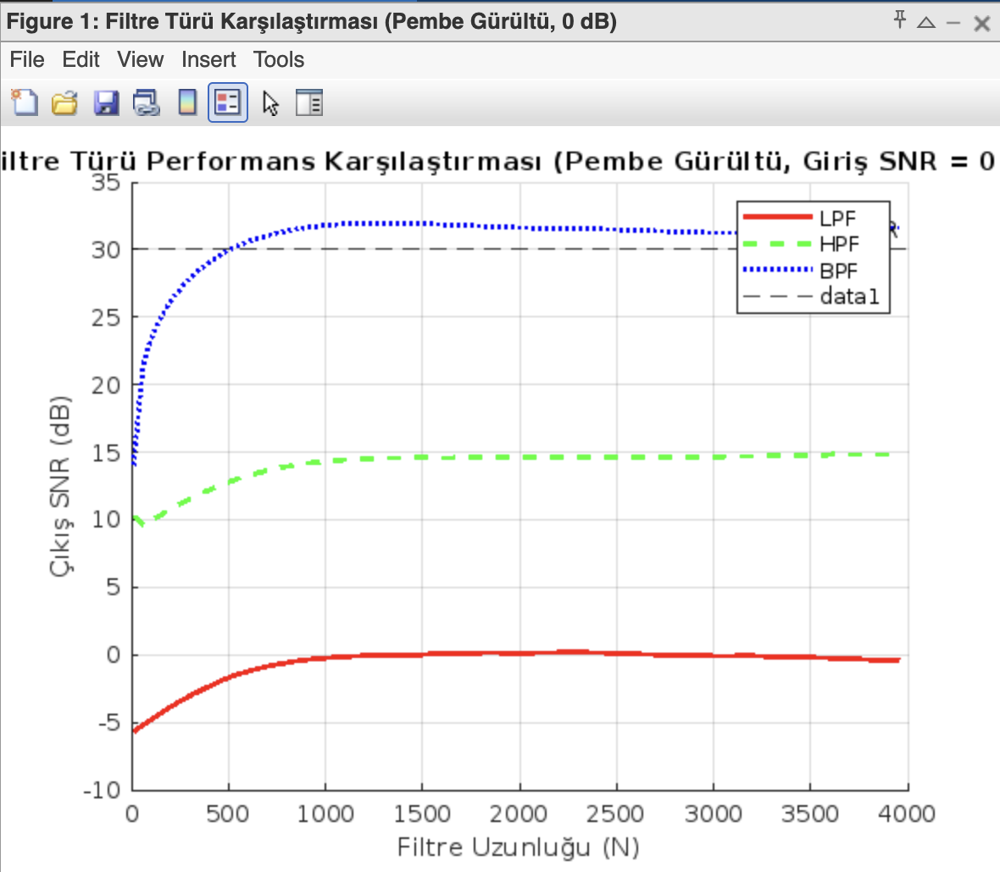
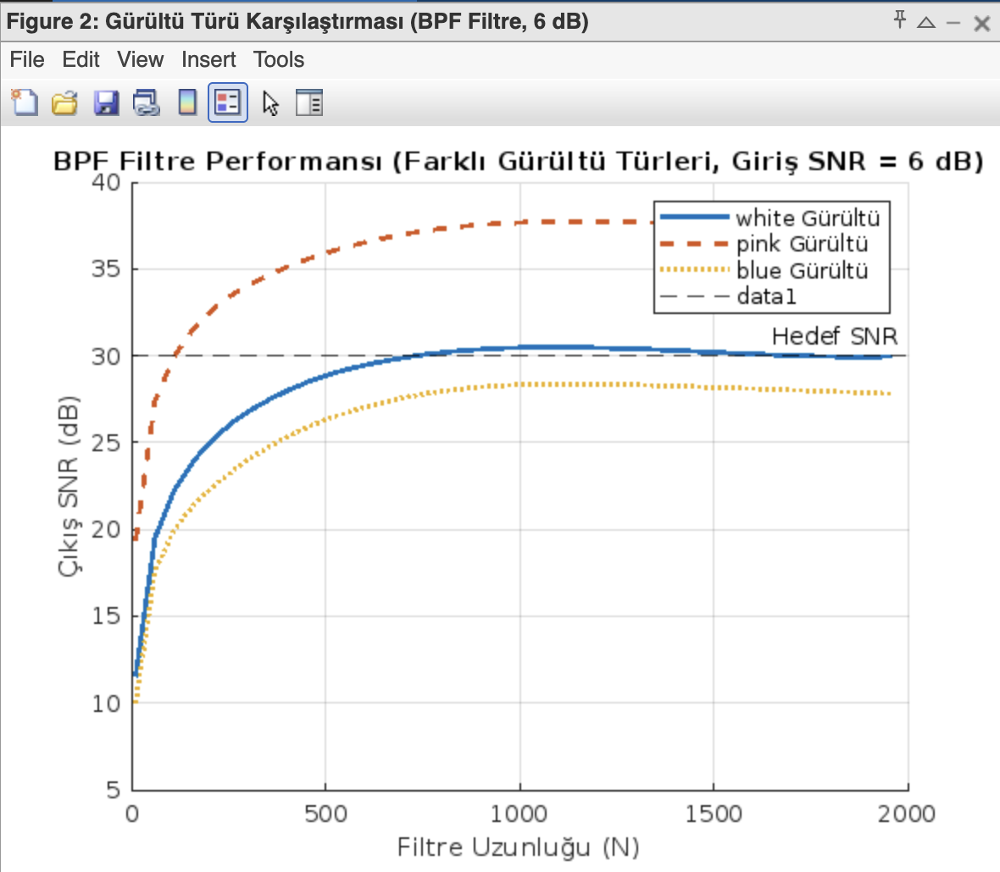
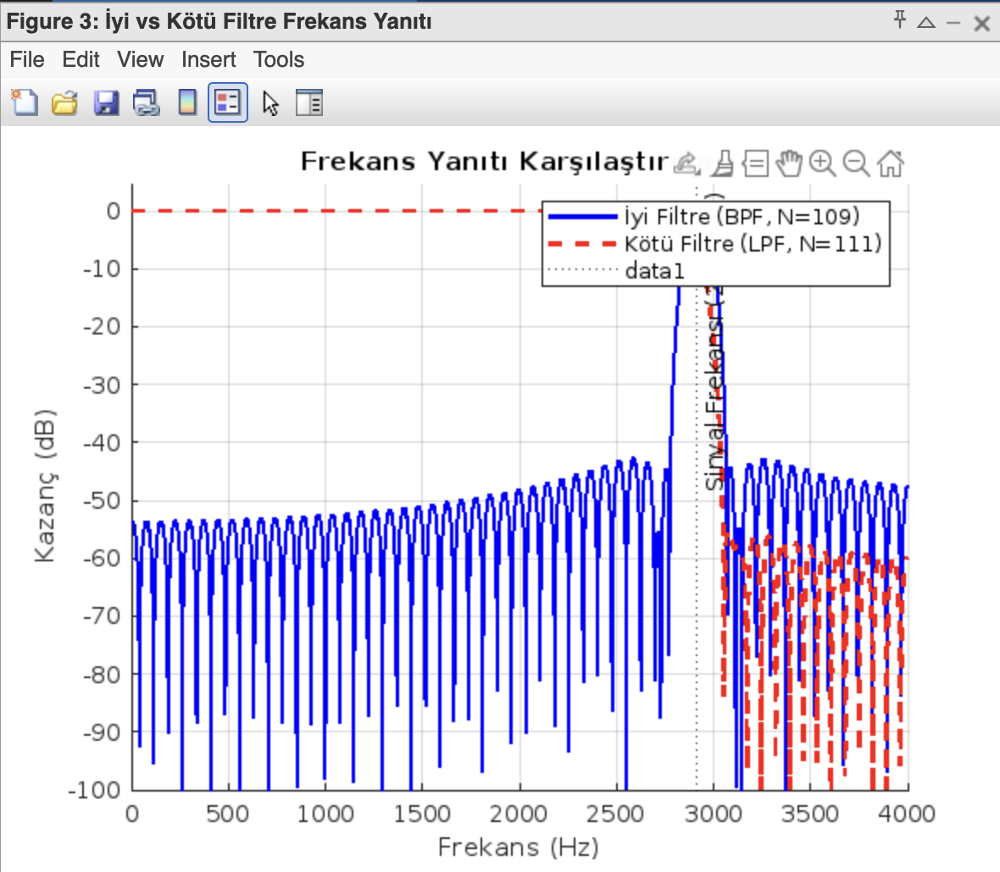
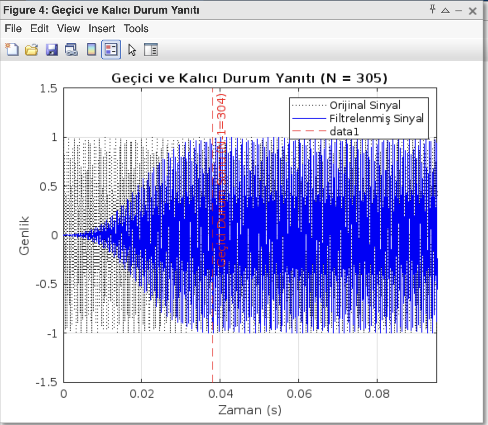

# FIR Filtreler Kullanarak Gürültülü Sinyallerin SNR İyileştirilmesi ve Filtre Uzunluğu Analizi


Bu depo, **ELE-306 Sayısal İşaret İşleme Dersi** kapsamında gerçekleştirilen final projesini içermektedir. Proje, farklı istatistiksel özelliklere sahip gürültülerle (beyaz, pembe, mavi) bozulmuş bir sinüzoidal sinyalin, Sonlu Dürtü Yanıtlı (FIR) filtreler kullanılarak kalitesinin artırılmasını ve bu süreçte filtre parametrelerinin etkisini analiz etmeyi amaçlamaktadır.

---

## 📖 Projenin Amacı

Projenin temel hedefleri şunlardır:
- Farklı başlangıç Sinyal-Gürültü Oranlarına (-6 dB, 0 dB, 6 dB) sahip gürültülü sinyaller oluşturmak.
- Alçak Geçiren (LPF), Yüksek Geçiren (HPF) ve Bant Geçiren (BPF) FIR filtreler tasarlamak.
- **30 dB** çıkış SNR hedefine ulaşmak için gereken **minimum filtre uzunluğunu ($N_{min}$)** sistematik olarak bulmak.
- Filtre uzunluğunun (N), filtrenin frekans yanıtı, gürültü bastırma performansı ve işlem karmaşıklığı üzerindeki etkilerini analiz etmek.
- Farklı gürültü ve filtre türleri için performans-maliyet ödünleşmesini değerlendirmek.

## 🔑 Temel Konseptler

- **Sinyal-Gürültü Oranı (SNR):** Bir sinyalin gücünün arka plandaki gürültünün gücüne oranıdır ve sinyal kalitesinin temel bir ölçütüdür.
- **Gürültü Modelleri:**
  - **Beyaz Gürültü:** Gücü tüm frekanslara eşit yayılmıştır.
  - **Pembe Gürültü:** Gücü düşük frekanslarda yoğundur ($1/f$).
  - **Mavi Gürültü:** Gücü yüksek frekanslarda yoğundur ($f$).
- **FIR Filtreler:** Sadece giriş örneklerini kullanan, her zaman kararlı ve kolayca doğrusal fazlı tasarlanabilen sayısal filtrelerdir. Bu projede `Hamming` penceresi kullanılarak tasarlanmışlardır.

---

## 📂 Depo İçeriği

Bu depoda aşağıdaki dosyalar bulunmaktadır:

├── proje_ana_kod.m             # Projenin tüm adımlarını yürüten ana MATLAB betiği
├── design_fir_filter.m         # FIR filtreleri tasarlayan yardımcı fonksiyon
├── pinknoise.m                 # Pembe gürültü üreten yardımcı fonksiyon
├── bluenoise.m                 # Mavi gürültü üreten yardımcı fonksiyon
└── README.md                   # Bu dosya

---

## 🚀 Kurulum ve Çalıştırma

Projeyi kendi bilgisayarınızda çalıştırmak için aşağıdaki adımları izleyin:

1.  **Depoyu Klonlayın:**
    ```bash
    git clone https://github.com/erdobozkurt/FIR-Filter-SNR-Analysis.git
    ```
2.  **MATLAB'i Açın:** Klonladığınız klasörü MATLAB'de açın.
3.  **Betiği Çalıştırın:** Tüm `.m` dosyalarının aynı klasörde olduğundan emin olun ve komut penceresine aşağıdaki komutu yazarak ana betiği çalıştırın:
    ```matlab
    proje_ana_kod
    ```
4.  **Sonuçları Gözlemleyin:** Betik çalışmaya başladığında, komut penceresinde her bir senaryo için yapılan analizleri ve bulunan $N_{min}$ değerlerini göreceksiniz. Çalışma tamamlandığında, sonuçların özet tablosu komut penceresine yazdırılacak ve analiz için gerekli karşılaştırmalı grafikler otomatik olarak oluşturulacaktır.

---

## 📊 Elde Edilen Temel Sonuçlar ve Çıkarımlar

Bu projenin sonunda elde edilen en önemli mühendislik çıkarımları şunlardır:

* **BPF'nin Üstünlüğü:** Bant Geçiren Filtre (BPF), sinyalin frekansını hassas bir şekilde hedefleyebildiği için diğer tüm filtre türlerinden çok daha üstün bir performans göstermiştir.
* **Bağlamın Önemi:** Bir filtrenin etkinliği, sadece kendi türüne değil, **sinyal ve gürültünün frekans spektrumundaki göreceli konumlarına** kritik derecede bağlıdır. Projemizdeki sinyal (2917 Hz) yüksek bir frekansta olduğu için, LPF filtresi mavi gürültünün en güçlü olduğu bölgeyi de içeri almak zorunda kalmış ve tamamen başarısız olmuştur. Bu, "doğru aracın yanlış problemde" nasıl işe yaramadığının mükemmel bir örneğidir.
* **Fizibilite ve Limitler:** 30 dB gibi yüksek bir hedefe ulaşmak her zaman mümkün değildir. Bu hedefe sadece, BPF filtresinin pembe ve mavi gürültü gibi belirli gürültü türleriyle ve görece iyi başlangıç koşullarında birleştiği birkaç senaryoda ulaşılabilmiştir.
* **Performans-Maliyet Ödünleşmesi:** Daha zorlu bir senaryoyu çözmek, çok daha yüksek bir işlem maliyeti gerektirir. Örneğin, pembe gürültüyü temizlemek için $N=109$ yeterliyken, mavi gürültü için $N=905$ gerekmesi, performans artışının maliyetinin doğrusal olmadığını göstermektedir.

## 🖼️ Görsel Sonuçlar ve Analizleri
Aşağıda, projenin temel bulgularını destekleyen ve proje_ana_kod.m betiği tarafından otomatik olarak üretilen temel grafikler ve açıklamaları yer almaktadır.

* **Grafik 1: Filtre Türü Performans Karşılaştırması**


**Ne Gösteriyor?** Bu grafik, pembe gürültü ve 0 dB başlangıç SNR'ı gibi zorlu bir senaryoda, üç farklı filtre türünün (LPF, HPF, BPF) filtre uzunluğu (N) arttıkça çıkış SNR'ını nasıl değiştirdiğini göstermektedir.

**Ne Anlama Geliyor?** Grafikten de açıkça görüldüğü gibi, BPF'nin performansı N arttıkça hızla yükselerek 30 dB hedefine doğru ilerlerken, LPF ve HPF'nin performansı çok düşük seviyelerde kalmaktadır. Bu, projenin ana bulgularından birini görsel olarak kanıtlar: Sinyalin frekansı bilindiğinde, BPF diğer filtre türlerine göre ezici bir üstünlüğe sahiptir.

* **Grafik 2: Gürültü Türü Performans Karşılaştırması**


**Ne Gösteriyor?** Bu grafik, en iyi filtremiz olan BPF'nin, farklı istatistiksel özelliklere sahip gürültü türlerine (beyaz, pembe, mavi) karşı performansını karşılaştırmaktadır.

**Ne Anlama Geliyor?** BPF'nin pembe gürültüyü temizlemede en başarılı olduğu (SNR'ın en hızlı arttığı), beyaz ve mavi gürültüyü temizlemenin ise daha zorlu olduğu net bir şekilde görülmektedir. Bu, filtrenin başarısının sadece kendi yapısına değil, aynı zamanda karşılaştığı gürültünün spektral karakteristiğine de ne kadar bağlı olduğunu gösterir.

* **Grafik 3: Frekans Yanıtı Analizi ("İyi" vs "Kötü" Filtre)**


**Ne Gösteriyor?** Bu grafik, başarılı bir filtrenin (pembe gürültü için tasarlanmış BPF) frekans yanıtı ile başarısız bir filtrenin (mavi gürültü için tasarlanmış LPF) frekans yanıtını üst üste çizmektedir. Sinyalimizin bulunduğu 2917 Hz frekansı da işaretlenmiştir.

**Ne Anlama Geliyor?** Bu, projedeki en önemli "Neden?" sorusunun cevabıdır. Mavi BPF, sadece sinyalin etrafındaki çok dar bir "geçit" bırakırken, kırmızı LPF sinyali kurtarmak uğruna gürültünün en güçlü olduğu devasa bir frekans bandını da içeri aldığını gösterir. Bu görsel, bir filtrenin başarısızlığının ardındaki temel fiziksel nedeni somut bir şekilde ortaya koyar.

* **Grafik 4: Geçici ve Kalıcı Durum Yanıtı**


**Ne Gösteriyor?** Bu grafik, tasarlanan bir FIR filtresine temiz bir sinüzoidal sinyal uygulandığında, çıkış sinyalinin zaman içindeki davranışını göstermektedir.

**Ne Anlama Geliyor?** Grafiğin başında, çıkışın ilk N-1 örnek boyunca kararsız bir "Geçici Durum" (Transient Response) sergilediği açıkça görülmektedir. Bu sürenin sonunda filtre kararlı hale gelerek sinyali beklendiği gibi (genliği ve fazı değişmiş olarak) geçirmeye başlar. Bu, FIR filtrelerin doğası gereği sahip olduğu gecikmeyi ve kararlı duruma geçme süresini pratik olarak doğrular.

---

## 🎓 Ders Bilgileri

Bu proje, **Süleyman Demirel Üniversitesi Elektrik-Elektronik Mühendisliği Bölümü**'nde, **Dr. Öğr. Üyesi Turgay KOÇ** tarafından yürütülen **ELE-306 Sayısal İşaret İşleme** dersi kapsamında hazırlanmıştır.